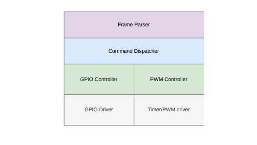
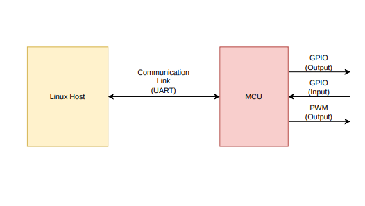

# mcu-co firmware

This repository holds the bare-metal firmware for the STM32G474RE, a Cortex-M4F class microcontroller.
The firmware turns the microcontroller into an I/O co-processor for a Linux single-board computer.
The SBC keeps the application logic and drives the MCU over a UART link, sending binary-framed commands
to configure and operate GPIO pins, PWM outputs, and pin-change interrupts — including
interrupt-to-output bindings that the firmware services on its own, with no host round-trip.

It is written in C99 directly against the CMSIS device headers with no STM32 HAL, I did this
because I wanted practice writing drivers and a complete understanding of the MCU architecture.

## Features

**GPIO** — configure any pin as an input or an output, drive outputs high or low, and read
input levels.

**Pin-change interrupts** — arm any pin to trigger on a rising edge, a falling edge, or both.

**Interrupt-to-output bindings** — bind an armed edge on one pin to an action on another: drive
it low, drive it high, or toggle it. The MCU services these itself, so the host stays out of the
loop once the binding is set.

**PWM** — twelve outputs in three groups of four. Frequency is set per group, duty per pin, and
both can be read back.

**A checked command protocol** — strict master-slave with one command in flight at a time,
CRC-checked frames, and an ACK or a NACK with a reason code for every command sent.

The wire format, opcodes, and per-command details are in [mcu-co_Protocol.md](mcu-co_Protocol.md).

## Software Architecture

The main parts of the firmware are the following modules:

**Frame Parser** — turns the incoming byte stream into complete command frames, and builds the
response frames that go back to the host.

**Command Dispatcher** — reads a frame's opcode, hands it to the controller that owns it, and
packages the result as an ACK or a NACK.

**GPIO Controller** — translates the GPIO and interrupt commands into driver calls, and keeps
track of which pins are bound to which interrupt actions.

**PWM Controller** — translates the PWM commands into timer calls, and tracks which groups and
pins have been claimed.

**GPIO Driver** — the register-level driver for the GPIO ports: pin direction, levels, alternate
functions, and interrupt setup.

**Timer/PWM Driver** — the register-level driver for TIM2, TIM3 and TIM4: prescaler and reload
for frequency, compare registers for duty.

## Hardware Architecture

The hardware side is two devices and one link between them:

**Linux Host** — the SBC that runs the application logic. Every operation starts here, as a
command it sends over the link.

**Communication Link (UART)** — the single serial connection between the two, carrying commands
one way and ACK/NACK replies the other.

**MCU** — the STM32G474RE. It owns the pins and does nothing on its own; it executes the commands
the host sends and answers each one.

**GPIO (Output)** — pins the MCU drives high or low on command.

**GPIO (Input)** — pins the MCU reads on command, and can watch for edges.

**PWM (Output)** — pins the MCU drives with a square wave at a set frequency and duty cycle.

